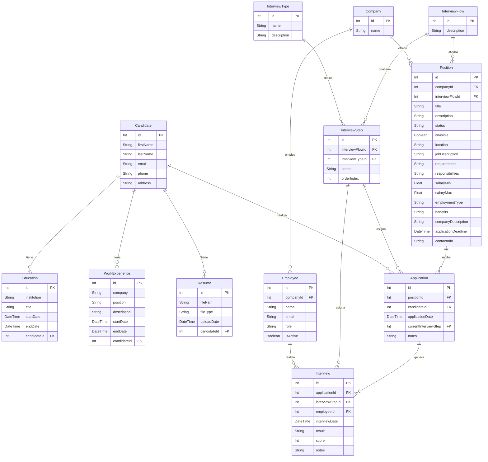

# Documentación del Modelo de Datos

## Tablas y Campos

### Candidate
- **id**: Int, PK, autoincremental
- **firstName**: String (100)
- **lastName**: String (100)
- **email**: String (255), único
- **phone**: String (15), opcional
- **address**: String (100), opcional

Relaciones:
- 1:N con Education, WorkExperience, Resume, Application

---

### Education
- **id**: Int, PK, autoincremental
- **institution**: String (100)
- **title**: String (250)
- **startDate**: DateTime
- **endDate**: DateTime, opcional
- **candidateId**: FK a Candidate

---

### WorkExperience
- **id**: Int, PK, autoincremental
- **company**: String (100)
- **position**: String (100)
- **description**: String (200), opcional
- **startDate**: DateTime
- **endDate**: DateTime, opcional
- **candidateId**: FK a Candidate

---

### Resume
- **id**: Int, PK, autoincremental
- **filePath**: String (500)
- **fileType**: String (50)
- **uploadDate**: DateTime
- **candidateId**: FK a Candidate

---

### Company
- **id**: Int, PK, autoincremental
- **name**: String, único

Relaciones:
- 1:N con Employee, Position

---

### Employee
- **id**: Int, PK, autoincremental
- **companyId**: FK a Company
- **name**: String
- **email**: String, único
- **role**: String
- **isActive**: Boolean, por defecto true

Relaciones:
- 1:N con Interview

---

### InterviewType
- **id**: Int, PK, autoincremental
- **name**: String
- **description**: String, opcional

Relaciones:
- 1:N con InterviewStep

---

### InterviewFlow
- **id**: Int, PK, autoincremental
- **description**: String, opcional

Relaciones:
- 1:N con InterviewStep, Position

---

### InterviewStep
- **id**: Int, PK, autoincremental
- **interviewFlowId**: FK a InterviewFlow
- **interviewTypeId**: FK a InterviewType
- **name**: String
- **orderIndex**: Int

Relaciones:
- 1:N con Application, Interview

---

### Position
- **id**: Int, PK, autoincremental
- **companyId**: FK a Company
- **interviewFlowId**: FK a InterviewFlow
- **title**: String
- **description**: String
- **status**: String, por defecto "Draft"
- **isVisible**: Boolean, por defecto false
- **location**: String
- **jobDescription**: String
- **requirements**: String, opcional
- **responsibilities**: String, opcional
- **salaryMin**: Float, opcional
- **salaryMax**: Float, opcional
- **employmentType**: String, opcional
- **benefits**: String, opcional
- **companyDescription**: String, opcional
- **applicationDeadline**: DateTime, opcional
- **contactInfo**: String, opcional

Relaciones:
- 1:N con Application

---

### Application
- **id**: Int, PK, autoincremental
- **positionId**: FK a Position
- **candidateId**: FK a Candidate
- **applicationDate**: DateTime
- **currentInterviewStep**: FK a InterviewStep
- **notes**: String, opcional

Relaciones:
- 1:N con Interview

---

### Interview
- **id**: Int, PK, autoincremental
- **applicationId**: FK a Application
- **interviewStepId**: FK a InterviewStep
- **employeeId**: FK a Employee
- **interviewDate**: DateTime
- **result**: String, opcional
- **score**: Int, opcional
- **notes**: String, opcional

---

## Diagrama Mermaid

