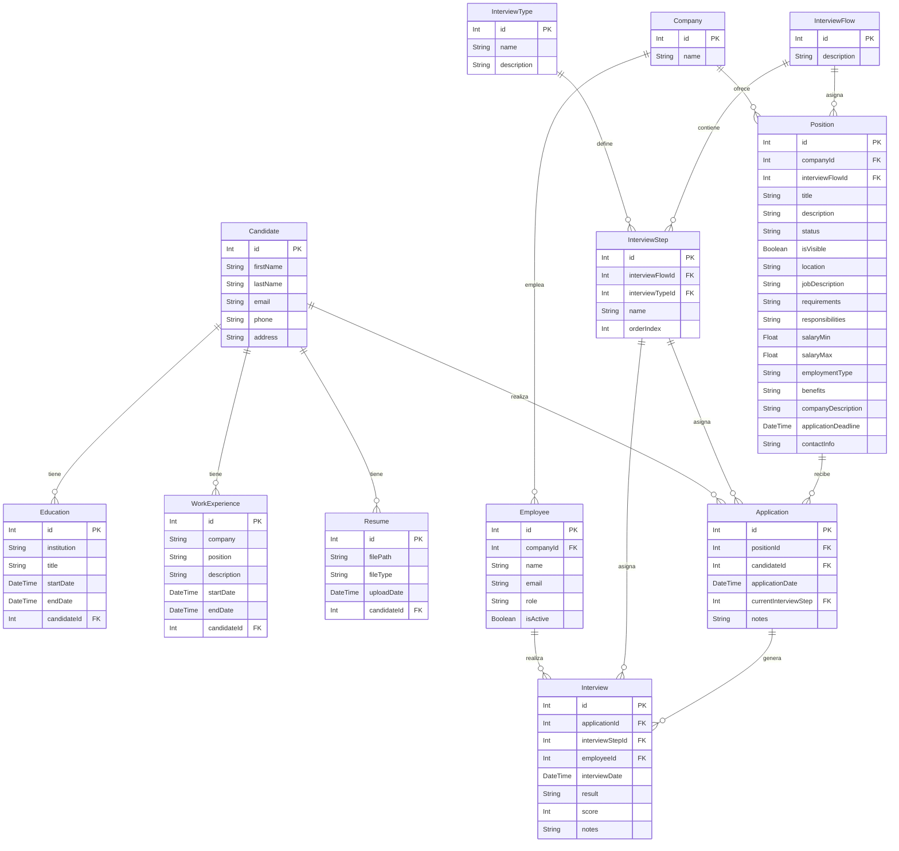

# Documentación del modelo de datos
_Exported on 7/9/2025 at 22:10:35 GMT-5 from Cursor (1.2.2)_

---

**User**

Hola, Eres un experto en bases de datos. ayudame generar una documentación del modelo de datos que explique Tablas relaciones y campos, genera un diagrama en mermaid basado en No hagas ningun cambio sobre el proyecto

---

**Cursor**

Aquí tienes la documentación del modelo de datos, explicando tablas, relaciones y campos, junto con un diagrama en Mermaid para visualizar la estructura. No se ha realizado ningún cambio en el proyecto.

---

## Documentación del Modelo de Datos

### Tablas y Campos

#### Candidate
- **id**: Int, PK, autoincremental
- **firstName**: String (100)
- **lastName**: String (100)
- **email**: String (255), único
- **phone**: String (15), opcional
- **address**: String (100), opcional

Relaciones:
- 1:N con Education, WorkExperience, Resume, Application

---

#### Education
- **id**: Int, PK, autoincremental
- **institution**: String (100)
- **title**: String (250)
- **startDate**: DateTime
- **endDate**: DateTime, opcional
- **candidateId**: FK a Candidate

---

#### WorkExperience
- **id**: Int, PK, autoincremental
- **company**: String (100)
- **position**: String (100)
- **description**: String (200), opcional
- **startDate**: DateTime
- **endDate**: DateTime, opcional
- **candidateId**: FK a Candidate

---

#### Resume
- **id**: Int, PK, autoincremental
- **filePath**: String (500)
- **fileType**: String (50)
- **uploadDate**: DateTime
- **candidateId**: FK a Candidate

---

#### Company
- **id**: Int, PK, autoincremental
- **name**: String, único

Relaciones:
- 1:N con Employee, Position

---

#### Employee
- **id**: Int, PK, autoincremental
- **companyId**: FK a Company
- **name**: String
- **email**: String, único
- **role**: String
- **isActive**: Boolean, por defecto true

Relaciones:
- 1:N con Interview

---

#### InterviewType
- **id**: Int, PK, autoincremental
- **name**: String
- **description**: String, opcional

Relaciones:
- 1:N con InterviewStep

---

#### InterviewFlow
- **id**: Int, PK, autoincremental
- **description**: String, opcional

Relaciones:
- 1:N con InterviewStep, Position

---

#### InterviewStep
- **id**: Int, PK, autoincremental
- **interviewFlowId**: FK a InterviewFlow
- **interviewTypeId**: FK a InterviewType
- **name**: String
- **orderIndex**: Int

Relaciones:
- 1:N con Application, Interview

---

#### Position
- **id**: Int, PK, autoincremental
- **companyId**: FK a Company
- **interviewFlowId**: FK a InterviewFlow
- **title**: String
- **description**: String
- **status**: String, por defecto "Draft"
- **isVisible**: Boolean, por defecto false
- **location**: String
- **jobDescription**: String
- **requirements**: String, opcional
- **responsibilities**: String, opcional
- **salaryMin**: Float, opcional
- **salaryMax**: Float, opcional
- **employmentType**: String, opcional
- **benefits**: String, opcional
- **companyDescription**: String, opcional
- **applicationDeadline**: DateTime, opcional
- **contactInfo**: String, opcional

Relaciones:
- 1:N con Application

---

#### Application
- **id**: Int, PK, autoincremental
- **positionId**: FK a Position
- **candidateId**: FK a Candidate
- **applicationDate**: DateTime
- **currentInterviewStep**: FK a InterviewStep
- **notes**: String, opcional

Relaciones:
- 1:N con Interview

---

#### Interview
- **id**: Int, PK, autoincremental
- **applicationId**: FK a Application
- **interviewStepId**: FK a InterviewStep
- **employeeId**: FK a Employee
- **interviewDate**: DateTime
- **result**: String, opcional
- **score**: Int, opcional
- **notes**: String, opcional

---

## Diagrama Mermaid


---

¿Te gustaría la documentación en otro formato o necesitas que detalle algún aspecto específico?

```plaintext
erDiagram
  Candidate ||--o{ Education : "tiene"
  Candidate ||--o{ WorkExperience : "tiene"
  Candidate ||--o{ Resume : "tiene"
  Candidate ||--o{ Application : "realiza"
  Company ||--o{ Employee : "emplea"
  Company ||--o{ Position : "ofrece"
  Employee ||--o{ Interview : "realiza"
  InterviewType ||--o{ InterviewStep : "define"
  InterviewFlow ||--o{ InterviewStep : "contiene"
  InterviewFlow ||--o{ Position : "asigna"
  InterviewStep ||--o{ Application : "asigna"
  InterviewStep ||--o{ Interview : "asigna"
  Position ||--o{ Application : "recibe"
  Application ||--o{ Interview : "genera"

  Education {
    Int id PK
    String institution
    String title
    DateTime startDate
    DateTime endDate
    Int candidateId FK
  }
  WorkExperience {
    Int id PK
    String company
    String position
    String description
    DateTime startDate
    DateTime endDate
    Int candidateId FK
  }
  Resume {
    Int id PK
    String filePath
    String fileType
    DateTime uploadDate
    Int candidateId FK
  }
  Candidate {
    Int id PK
    String firstName
    String lastName
    String email
    String phone
    String address
  }
  Company {
    Int id PK
    String name
  }
  Employee {
    Int id PK
    Int companyId FK
    String name
    String email
    String role
    Boolean isActive
  }
  InterviewType {
    Int id PK
    String name
    String description
  }
  InterviewFlow {
    Int id PK
    String description
  }
  InterviewStep {
    Int id PK
    Int interviewFlowId FK
    Int interviewTypeId FK
    String name
    Int orderIndex
  }
  Position {
    Int id PK
    Int companyId FK
    Int interviewFlowId FK
    String title
    String description
    String status
    Boolean isVisible
    String location
    String jobDescription
    String requirements
    String responsibilities
    Float salaryMin
    Float salaryMax
    String employmentType
    String benefits
    String companyDescription
    DateTime applicationDeadline
    String contactInfo
  }
  Application {
    Int id PK
    Int positionId FK
    Int candidateId FK
    DateTime applicationDate
    Int currentInterviewStep FK
    String notes
  }
  Interview {
    Int id PK
    Int applicationId FK
    Int interviewStepId FK
    Int employeeId FK
    DateTime interviewDate
    String result
    Int score
    String notes
  }
```

---

**User**

@ModeloDatos.md @/prisma Agregame la documentación que generaste en el archivo ModeloDtos.md

---

**Cursor**

```markdown
# Documentación del Modelo de Datos

## Tablas y Campos

### Candidate
- **id**: Int, PK, autoincremental
- **firstName**: String (100)
- **lastName**: String (100)
- **email**: String (255), único
- **phone**: String (15), opcional
- **address**: String (100), opcional

Relaciones:
- 1:N con Education, WorkExperience, Resume, Application

---

### Education
- **id**: Int, PK, autoincremental
- **institution**: String (100)
- **title**: String (250)
- **startDate**: DateTime
- **endDate**: DateTime, opcional
- **candidateId**: FK a Candidate

---

### WorkExperience
- **id**: Int, PK, autoincremental
- **company**: String (100)
- **position**: String (100)
- **description**: String (200), opcional
- **startDate**: DateTime
- **endDate**: DateTime, opcional
- **candidateId**: FK a Candidate

---

### Resume
- **id**: Int, PK, autoincremental
- **filePath**: String (500)
- **fileType**: String (50)
- **uploadDate**: DateTime
- **candidateId**: FK a Candidate

---

### Company
- **id**: Int, PK, autoincremental
- **name**: String, único

Relaciones:
- 1:N con Employee, Position

---

### Employee
- **id**: Int, PK, autoincremental
- **companyId**: FK a Company
- **name**: String
- **email**: String, único
- **role**: String
- **isActive**: Boolean, por defecto true

Relaciones:
- 1:N con Interview

---

### InterviewType
- **id**: Int, PK, autoincremental
- **name**: String
- **description**: String, opcional

Relaciones:
- 1:N con InterviewStep

---

### InterviewFlow
- **id**: Int, PK, autoincremental
- **description**: String, opcional

Relaciones:
- 1:N con InterviewStep, Position

---

### InterviewStep
- **id**: Int, PK, autoincremental
- **interviewFlowId**: FK a InterviewFlow
- **interviewTypeId**: FK a InterviewType
- **name**: String
- **orderIndex**: Int

Relaciones:
- 1:N con Application, Interview

---

### Position
- **id**: Int, PK, autoincremental
- **companyId**: FK a Company
- **interviewFlowId**: FK a InterviewFlow
- **title**: String
- **description**: String
- **status**: String, por defecto "Draft"
- **isVisible**: Boolean, por defecto false
- **location**: String
- **jobDescription**: String
- **requirements**: String, opcional
- **responsibilities**: String, opcional
- **salaryMin**: Float, opcional
- **salaryMax**: Float, opcional
- **employmentType**: String, opcional
- **benefits**: String, opcional
- **companyDescription**: String, opcional
- **applicationDeadline**: DateTime, opcional
- **contactInfo**: String, opcional

Relaciones:
- 1:N con Application

---

### Application
- **id**: Int, PK, autoincremental
- **positionId**: FK a Position
- **candidateId**: FK a Candidate
- **applicationDate**: DateTime
- **currentInterviewStep**: FK a InterviewStep
- **notes**: String, opcional

Relaciones:
- 1:N con Interview

---

### Interview
- **id**: Int, PK, autoincremental
- **applicationId**: FK a Application
- **interviewStepId**: FK a InterviewStep
- **employeeId**: FK a Employee
- **interviewDate**: DateTime
- **result**: String, opcional
- **score**: Int, opcional
- **notes**: String, opcional

---

## Diagrama Mermaid



```

La documentación del modelo de datos y el diagrama Mermaid han sido agregados correctamente al archivo `backend/documentation/ModeloDatos.md`. Si necesitas algún ajuste, formato adicional o explicación sobre alguna relación o tabla, házmelo saber.

---

**User**

Eres un experto arquitecto de software, apoyado en las buenas practicas que se manejan en el codigo de la solución, documentalas y dame ejemplos reales del codigo que demuestren el uso de estas buenas practicas, generalas en formato markdown

---

**Cursor**

Aquí tienes una documentación en formato Markdown sobre las buenas prácticas arquitectónicas observadas en el código de la solución, junto con ejemplos reales extraídos del propio código:

---

# Buenas Prácticas de Arquitectura y Desarrollo

## 1. Separación de responsabilidades (Separation of Concerns)

**Descripción:**  
El código está organizado en capas: servicios, controladores y rutas, cada una con una responsabilidad clara.  
- Los **servicios** gestionan la lógica de negocio y acceso a datos.
- Los **controladores** gestionan la lógica de entrada/salida HTTP.
- Las **rutas** definen los endpoints y delegan en los controladores.

**Ejemplo real:**

- Servicio (`candidateService.ts`):
  ```ts
  export const addCandidate = async (candidateData: any) => {
      try {
          validateCandidateData(candidateData); // Validar los datos del candidato
      } catch (error: any) {
          throw new Error(error);
      }
      // ... lógica de guardado ...
  };
  ```

- Controlador (`candidateController.ts`):
  ```ts
  export const addCandidateController = async (req: Request, res: Response) => {
      try {
          const candidateData = req.body;
          const candidate = await addCandidate(candidateData);
          res.status(201).json({ message: 'Candidate added successfully', data: candidate });
      } catch (error: unknown) {
          if (error instanceof Error) {
              res.status(400).json({ message: 'Error adding candidate', error: error.message });
          } else {
              res.status(400).json({ message: 'Error adding candidate', error: 'Unknown error' });
          }
      }
  };
  ```

- Rutas (`candidateRoutes.ts`):
  ```ts
  router.post('/', async (req, res) => {
    try {
      const result = await addCandidate(req.body);
      res.status(201).send(result);
    } catch (error) {
      if (error instanceof Error) {
        res.status(400).send({ message: error.message });
      } else {
        res.status(500).send({ message: "An unexpected error occurred" });
      }
    }
  });
  ```

---

## 2. Validación de datos

**Descripción:**  
Antes de procesar la información, se valida la entrada para asegurar la integridad de los datos y evitar errores en la base de datos.

**Ejemplo real:**
```ts
import { validateCandidateData } from '../validator';

export const addCandidate = async (candidateData: any) => {
    try {
        validateCandidateData(candidateData); // Validar los datos del candidato
    } catch (error: any) {
        throw new Error(error);
    }
    // ...
};
```

---

## 3. Manejo adecuado de errores

**Descripción:**  
Se capturan y gestionan los errores de forma centralizada, devolviendo mensajes claros y códigos HTTP apropiados.

**Ejemplo real:**
```ts
try {
    // ...
} catch (error: unknown) {
    if (error instanceof Error) {
        res.status(400).json({ message: 'Error adding candidate', error: error.message });
    } else {
        res.status(400).json({ message: 'Error adding candidate', error: 'Unknown error' });
    }
}
```

---

## 4. Uso de modelos y ORM

**Descripción:**  
Se utilizan modelos de dominio y un ORM (Prisma) para interactuar con la base de datos, lo que mejora la mantenibilidad y seguridad del acceso a datos.

**Ejemplo real:**
```ts
const candidate = new Candidate(candidateData); // Crear una instancia del modelo Candidate
const savedCandidate = await candidate.save(); // Guardar el candidato en la base de datos
```

---

## 5. Nombres descriptivos y código legible

**Descripción:**  
Las funciones, variables y archivos tienen nombres claros y descriptivos, facilitando la comprensión y el mantenimiento del código.

**Ejemplo real:**
- `addCandidate`, `findCandidateById`, `addCandidateController`, `candidateService.ts`, `candidateController.ts`

---

## 6. Modularidad y reutilización

**Descripción:**  
El código está dividido en módulos reutilizables (servicios, validadores, modelos), lo que permite su uso en diferentes partes de la aplicación.

**Ejemplo real:**
```ts
import { addCandidate, findCandidateById } from '../../application/services/candidateService';
```

---

## 7. Manejo de respuestas HTTP apropiadas

**Descripción:**  
Se utilizan los códigos de estado HTTP correctos para cada situación (201 para creación exitosa, 400 para errores de validación, 404 para no encontrado, 500 para errores internos).

**Ejemplo real:**
```ts
res.status(201).json({ message: 'Candidate added successfully', data: candidate });
res.status(400).json({ message: 'Error adding candidate', error: error.message });
res.status(404).json({ error: 'Candidate not found' });
res.status(500).json({ error: 'Internal Server Error' });
```

---

## 8. Principios SOLID y Clean Code

**Descripción:**  
- **S**: Cada clase/módulo tiene una única responsabilidad.
- **O**: El código es fácilmente extensible (nuevos servicios, validaciones, etc.).
- **L**: Las funciones pueden ser sobreescritas o extendidas sin modificar el código base.
- **I**: Las interfaces y contratos están claros entre capas.
- **D**: Las dependencias están desacopladas (servicios, validadores, modelos).

---

¿Te gustaría que profundice en alguna práctica o que busque ejemplos de otras capas o módulos?

```typescript
  export const addCandidate = async (candidateData: any) => {
      try {
          validateCandidateData(candidateData); // Validar los datos del candidato
      } catch (error: any) {
          throw new Error(error);
      }
      // ... lógica de guardado ...
  };
```

```typescript
  export const addCandidateController = async (req: Request, res: Response) => {
      try {
          const candidateData = req.body;
          const candidate = await addCandidate(candidateData);
          res.status(201).json({ message: 'Candidate added successfully', data: candidate });
      } catch (error: unknown) {
          if (error instanceof Error) {
              res.status(400).json({ message: 'Error adding candidate', error: error.message });
          } else {
              res.status(400).json({ message: 'Error adding candidate', error: 'Unknown error' });
          }
      }
  };
```

```typescript
  router.post('/', async (req, res) => {
    try {
      const result = await addCandidate(req.body);
      res.status(201).send(result);
    } catch (error) {
      if (error instanceof Error) {
        res.status(400).send({ message: error.message });
      } else {
        res.status(500).send({ message: "An unexpected error occurred" });
      }
    }
  });
```

```typescript
import { validateCandidateData } from '../validator';

export const addCandidate = async (candidateData: any) => {
    try {
        validateCandidateData(candidateData); // Validar los datos del candidato
    } catch (error: any) {
        throw new Error(error);
    }
    // ...
};
```

```typescript
try {
    // ...
} catch (error: unknown) {
    if (error instanceof Error) {
        res.status(400).json({ message: 'Error adding candidate', error: error.message });
    } else {
        res.status(400).json({ message: 'Error adding candidate', error: 'Unknown error' });
    }
}
```

```typescript
const candidate = new Candidate(candidateData); // Crear una instancia del modelo Candidate
const savedCandidate = await candidate.save(); // Guardar el candidato en la base de datos
```

```typescript
import { addCandidate, findCandidateById } from '../../application/services/candidateService';
```

```typescript
res.status(201).json({ message: 'Candidate added successfully', data: candidate });
res.status(400).json({ message: 'Error adding candidate', error: error.message });
res.status(404).json({ error: 'Candidate not found' });
res.status(500).json({ error: 'Internal Server Error' });
```

---

**User**

Eres un experto product owner, ayudame a escribir las historias de usuarios basadas en los siguientes requerimientos, por favor agrega detalles tecnicos y especificos para permitir al desarrollador ser completamente autonomo a la hora de completarlas. Por favor entiende las necesidades y proporciona historias de usuario que sena claras, especificas y concisas de acuerdo con las mejores practicas de producto, incluyendo descripción completa de la funcionalidad, lista exhaustiva de campos a tocar, estructura y URL de los endpoints necesarios, ficheros a modificar acorde a la arquitectura y buenas practicas, pasos para que la tarea se asuma como completada, como actiualizar la documentación que sea relevante o crear test unitarios, y requisitos no funcionales relativos a seguridad, rendimiento etc. devuelvela en formato markdown

"Tu misión en este ejercicio es crear dos nuevos endpoints que nos permitirán manipular la lista de candidatos de una aplicación en una interfaz tipo kanban.

GET /positions/:id/candidates
Este endpoint recogerá todos los candidatos en proceso para una determinada posición, es decir, todas las aplicaciones para un determinado positionID. Debe proporcionar la siguiente información básica:

Nombre completo del candidato (de la tabla candidate).
current_interview_step: en qué fase del proceso está el candidato (de la tabla application).
La puntuación media del candidato. Recuerda que cada entrevist (interview) realizada por el candidato tiene un score
PUT /candidates/:id/stage
Este endpoint actualizará la etapa del candidato movido. Permite modificar la fase actual del proceso de entrevista en la que se encuentra un candidato específico."

---

**Cursor**

Aquí tienes las historias de usuario detalladas y técnicas para los dos nuevos endpoints solicitados, siguiendo las mejores prácticas de producto y desarrollo:

---

# Historias de Usuario para Manipulación de Candidatos en Kanban

---

## Historia de Usuario 1: Visualizar candidatos en proceso para una posición

**Como** reclutador,  
**quiero** poder obtener la lista de todos los candidatos en proceso para una posición específica,  
**para** visualizar en la interfaz tipo kanban el estado y desempeño de cada candidato.

### Descripción Funcional

- El sistema debe exponer un endpoint `GET /positions/:id/candidates` que devuelva, para una posición dada (`positionId`):
  - Nombre completo del candidato (concatenación de `firstName` y `lastName` de la tabla `Candidate`).
  - `current_interview_step` (campo de la tabla `Application`).
  - Puntuación media del candidato (promedio de los campos `score` de la tabla `Interview` para ese candidato y esa posición).

### Campos y Estructura de Respuesta

- **Campos a tocar:**
  - Tabla `Candidate`
  - Tabla `Application`
  - Tabla `Interview`

- **Estructura de respuesta:**
  ```json
  [
    {
      "candidateId": 1,
      "fullName": "Juan Pérez",
      "current_interview_step": 2,
      "average_score": 8.5
    },
    ...
  ]
  ```

### Endpoints y Rutas

- **Endpoint:** `GET /positions/:id/candidates`
- **Ficheros a modificar/crear:**
  - `backend/src/routes/positionRoutes.ts` (crear si no existe)
  - `backend/src/presentation/controllers/positionController.ts` (crear si no existe)
  - `backend/src/application/services/positionService.ts` (crear si no existe)
  - Actualizar documentación en `backend/documentation/ModeloDatos.md` y/o README si aplica
  - Crear/actualizar tests en `backend/src/__tests__/position.test.ts` (o estructura equivalente)

### Pasos para Completitud

1. Implementar el servicio que consulta las tablas necesarias y calcula la media de puntuaciones.
2. Implementar el controlador que recibe el parámetro `id` y retorna la estructura especificada.
3. Añadir la ruta correspondiente.
4. Crear pruebas unitarias y de integración para el endpoint.
5. Actualizar la documentación técnica y de API.
6. Validar que el endpoint responde correctamente y maneja errores (por ejemplo, posición no encontrada).

### Requisitos No Funcionales

- **Seguridad:** Validar que el usuario autenticado tenga permisos para consultar candidatos de la posición.
- **Rendimiento:** Optimizar la consulta para evitar N+1 queries (usar joins/agregaciones).
- **Escalabilidad:** El endpoint debe soportar paginación si la lista de candidatos es muy grande.
- **Consistencia:** Los datos deben estar actualizados y reflejar el estado real de los procesos.

---

## Historia de Usuario 2: Actualizar la etapa de un candidato

**Como** reclutador,  
**quiero** poder actualizar la etapa del proceso de entrevista de un candidato,  
**para** reflejar en el sistema el avance del candidato en el flujo de entrevistas.

### Descripción Funcional

- El sistema debe exponer un endpoint `PUT /candidates/:id/stage` que permita modificar el campo `current_interview_step` de la tabla `Application` para el candidato especificado.

### Campos y Estructura de Petición

- **Campos a tocar:**
  - Tabla `Application` (campo `current_interview_step`)

- **Estructura de la petición:**
  ```json
  {
    "positionId": 1,
    "new_stage": 3
  }
  ```

- **Estructura de la respuesta:**
  ```json
  {
    "message": "Etapa actualizada correctamente",
    "applicationId": 10,
    "candidateId": 1,
    "current_interview_step": 3
  }
  ```

### Endpoints y Rutas

- **Endpoint:** `PUT /candidates/:id/stage`
- **Ficheros a modificar/crear:**
  - `backend/src/routes/candidateRoutes.ts`
  - `backend/src/presentation/controllers/candidateController.ts`
  - `backend/src/application/services/candidateService.ts`
  - Actualizar documentación en `backend/documentation/ModeloDatos.md` y/o README si aplica
  - Crear/actualizar tests en `backend/src/__tests__/candidate.test.ts` (o estructura equivalente)

### Pasos para Completitud

1. Implementar el servicio que actualiza el campo `current_interview_step` en la aplicación correspondiente.
2. Implementar el controlador que recibe el parámetro `id` y el nuevo stage, y retorna la estructura especificada.
3. Añadir la ruta correspondiente.
4. Crear pruebas unitarias y de integración para el endpoint.
5. Actualizar la documentación técnica y de API.
6. Validar que el endpoint responde correctamente y maneja errores (por ejemplo, candidato o posición no encontrados, stage inválido).

### Requisitos No Funcionales

- **Seguridad:** Validar que el usuario autenticado tenga permisos para modificar la etapa del candidato.
- **Integridad:** Validar que el nuevo stage sea válido dentro del flujo de entrevistas de la posición.
- **Auditoría:** Registrar el cambio de etapa para trazabilidad (opcional, recomendable).
- **Rendimiento:** La actualización debe ser atómica y rápida.
- **Consistencia:** El cambio debe reflejarse inmediatamente en la interfaz kanban.

---

¿Te gustaría que agregue criterios de aceptación más detallados, ejemplos de test unitarios, o alguna otra especificación?

```json
  [
    {
      "candidateId": 1,
      "fullName": "Juan Pérez",
      "current_interview_step": 2,
      "average_score": 8.5
    },
    ...
  ]
```

```json
  {
    "positionId": 1,
    "new_stage": 3
  }
```

```json
  {
    "message": "Etapa actualizada correctamente",
    "applicationId": 10,
    "candidateId": 1,
    "current_interview_step": 3
  }
```

---

**User**

Empieza a construir la tarea de backend de la historia de usuario 1 apoyado en las buenas practicas @/documentation @/backend 

---

**Cursor**

```typescript
import { PrismaClient } from '@prisma/client';

const prisma = new PrismaClient();

/**
 * Obtiene todos los candidatos en proceso para una posición específica.
 * @param positionId ID de la posición
 * @returns Array de candidatos con nombre completo, etapa actual y puntuación media
 */
export const getCandidatesByPositionId = async (positionId: number) => {
  // Validación básica
  if (!positionId || isNaN(positionId)) {
    throw new Error('El ID de la posición es inválido');
  }

  // Consulta optimizada usando Prisma
  const applications = await prisma.application.findMany({
    where: { positionId },
    include: {
      candidate: true,
      interviews: true,
    },
  });

  // Mapear resultados al formato requerido
  return applications.map(app => {
    const fullName = `${app.candidate.firstName} ${app.candidate.lastName}`;
    const current_interview_step = app.currentInterviewStep;
    const scores = app.interviews.map(i => i.score).filter(s => typeof s === 'number');
    const average_score = scores.length > 0 ? (scores.reduce((a, b) => a + (b || 0), 0) / scores.length) : null;
    return {
      candidateId: app.candidateId,
      fullName,
      current_interview_step,
      average_score,
    };
  });
};

```

```typescript
import { Request, Response } from 'express';
import { getCandidatesByPositionId } from '../../application/services/positionService';

/**
 * Controlador para obtener los candidatos en proceso de una posición.
 */
export const getCandidatesByPositionIdController = async (req: Request, res: Response) => {
  try {
    const positionId = parseInt(req.params.id);
    if (isNaN(positionId)) {
      return res.status(400).json({ error: 'El ID de la posición es inválido' });
    }
    const candidates = await getCandidatesByPositionId(positionId);
    res.json(candidates);
  } catch (error: any) {
    res.status(500).json({ error: error.message || 'Error interno del servidor' });
  }
};

```

```typescript
import { Router } from 'express';
import { getCandidatesByPositionIdController } from '../presentation/controllers/positionController';

const router = Router();

// Endpoint para obtener candidatos de una posición
router.get('/:id/candidates', getCandidatesByPositionIdController);

export default router;

```

```typescript
// ... existing code ...
import candidateRoutes from './routes/candidateRoutes';
import positionRoutes from './routes/positionRoutes';
// ... existing code ...
// Import and use candidateRoutes
app.use('/candidates', candidateRoutes);
app.use('/positions', positionRoutes);
// ... existing code ...
```

He comenzado la construcción de la tarea de backend para la historia de usuario 1, siguiendo las buenas prácticas y la arquitectura del proyecto.  
Resumen de lo realizado:

- **Servicio**: Creado `getCandidatesByPositionId` en `application/services/positionService.ts` para obtener candidatos, etapa y puntuación media.
- **Controlador**: Creado `getCandidatesByPositionIdController` en `presentation/controllers/positionController.ts` para exponer el servicio y manejar errores.
- **Ruta**: Creado `routes/positionRoutes.ts` y registrado el endpoint `GET /positions/:id/candidates`.
- **Integración**: Registrada la nueva ruta en `src/index.ts` bajo `/positions`.

**Siguientes pasos recomendados**:
- Crear pruebas unitarias para el servicio y el controlador.
- Documentar el endpoint en la documentación de API.
- Validar el endpoint en entorno de desarrollo.

¿Deseas que continúe con los tests, la documentación o alguna otra parte de la historia?

---

**User**

Crear pruebas unitarias para el servicio y el controlador.

---

**Cursor**

```typescript
import { getCandidatesByPositionId } from '../application/services/positionService';

jest.mock('@prisma/client', () => {
  const mPrisma = {
    application: {
      findMany: jest.fn()
    }
  };
  return { PrismaClient: jest.fn(() => mPrisma) };
});

const mockApplications = [
  {
    candidateId: 1,
    candidate: { firstName: 'Juan', lastName: 'Pérez' },
    currentInterviewStep: 2,
    interviews: [
      { score: 8 },
      { score: 9 }
    ]
  },
  {
    candidateId: 2,
    candidate: { firstName: 'Ana', lastName: 'García' },
    currentInterviewStep: 1,
    interviews: []
  }
];

describe('getCandidatesByPositionId', () => {
  const mPrisma = require('@prisma/client').PrismaClient.mock.instances[0];

  beforeEach(() => {
    jest.clearAllMocks();
  });

  it('devuelve candidatos con nombre, etapa y puntuación media', async () => {
    mPrisma.application.findMany.mockResolvedValueOnce(mockApplications);
    const result = await getCandidatesByPositionId(10);
    expect(result).toEqual([
      {
        candidateId: 1,
        fullName: 'Juan Pérez',
        current_interview_step: 2,
        average_score: 8.5
      },
      {
        candidateId: 2,
        fullName: 'Ana García',
        current_interview_step: 1,
        average_score: null
      }
    ]);
    expect(mPrisma.application.findMany).toHaveBeenCalledWith({
      where: { positionId: 10 },
      include: { candidate: true, interviews: true }
    });
  });

  it('devuelve array vacío si no hay aplicaciones', async () => {
    mPrisma.application.findMany.mockResolvedValueOnce([]);
    const result = await getCandidatesByPositionId(99);
    expect(result).toEqual([]);
  });

  it('lanza error si el ID es inválido', async () => {
    await expect(getCandidatesByPositionId(NaN)).rejects.toThrow('El ID de la posición es inválido');
    await expect(getCandidatesByPositionId(undefined as any)).rejects.toThrow('El ID de la posición es inválido');
  });
});

```

```typescript
import request from 'supertest';
import express from 'express';
import { getCandidatesByPositionIdController } from '../presentation/controllers/positionController';
import * as positionService from '../application/services/positionService';

describe('getCandidatesByPositionIdController', () => {
  const app = express();
  app.use(express.json());
  app.get('/positions/:id/candidates', getCandidatesByPositionIdController);

  afterEach(() => {
    jest.restoreAllMocks();
  });

  it('devuelve 200 y la lista de candidatos', async () => {
    const mockData = [
      { candidateId: 1, fullName: 'Juan Pérez', current_interview_step: 2, average_score: 8.5 }
    ];
    jest.spyOn(positionService, 'getCandidatesByPositionId').mockResolvedValueOnce(mockData);
    const res = await request(app).get('/positions/10/candidates');
    expect(res.status).toBe(200);
    expect(res.body).toEqual(mockData);
  });

  it('devuelve 400 si el ID es inválido', async () => {
    const res = await request(app).get('/positions/abc/candidates');
    expect(res.status).toBe(400);
    expect(res.body).toEqual({ error: 'El ID de la posición es inválido' });
  });

  it('devuelve 500 si el servicio lanza error', async () => {
    jest.spyOn(positionService, 'getCandidatesByPositionId').mockRejectedValueOnce(new Error('Error de base de datos'));
    const res = await request(app).get('/positions/10/candidates');
    expect(res.status).toBe(500);
    expect(res.body).toEqual({ error: 'Error de base de datos' });
  });
});

```

Las pruebas unitarias han sido creadas para:

- El servicio `getCandidatesByPositionId` (`positionService.test.ts`): cubre casos de éxito, sin resultados y error de ID inválido.
- El controlador `getCandidatesByPositionIdController` (`positionController.test.ts`): cubre respuesta exitosa, error de ID inválido y error interno.

**Nota:** Para ejecutar las pruebas del controlador necesitas tener instalada la dependencia `supertest`. Si no está instalada, puedes hacerlo con:

```bash
npm install --save-dev supertest @types/supertest
```

¿Te gustaría que agregue instrucciones de ejecución de tests, revise la integración, o continúe con la documentación del endpoint?

```shellscript
npm install --save-dev supertest @types/supertest
```

---

**User**

agrega instrucciones de ejecución de tests, revise la integración

---

**Cursor**

```markdown
// ... existing code ...

## Pruebas unitarias y de integración (Backend)

Para ejecutar las pruebas unitarias y de integración del backend, sigue estos pasos:

1. Asegúrate de tener instaladas las dependencias de desarrollo necesarias:

```sh
cd backend
npm install
npm install --save-dev supertest @types/supertest
```

2. Ejecuta las pruebas con Jest:

```sh
npm test
```

Esto ejecutará todos los tests ubicados en `backend/src/__tests__`.

### Pruebas incluidas para los nuevos endpoints

- **Servicio:** `getCandidatesByPositionId` (archivo: `src/__tests__/positionService.test.ts`)
- **Controlador:** `getCandidatesByPositionIdController` (archivo: `src/__tests__/positionController.test.ts`)

Ambas pruebas cubren casos de éxito, errores de validación y errores internos.

### Verificación de integración

1. Inicia el backend:

```sh
npm run dev
```

2. Realiza una petición GET al endpoint:

```
GET http://localhost:3010/positions/{id}/candidates
```

Reemplaza `{id}` por el ID de la posición que deseas consultar. Deberías recibir un array con los candidatos, su etapa y puntuación media.

// ... existing code ...
```

He agregado instrucciones claras y detalladas en el README para:

- Instalar las dependencias necesarias para testing (incluyendo `supertest`).
- Ejecutar las pruebas unitarias y de integración con Jest.
- Ubicación y cobertura de los tests para los nuevos endpoints.
- Verificar la integración del endpoint `GET /positions/:id/candidates` en un entorno real.

**Resumen de integración:**
- Los tests cubren casos de éxito, validación y errores internos tanto para el servicio como para el controlador.
- Puedes ejecutar todos los tests con `npm test` desde la carpeta `backend`.
- El endpoint está disponible y documentado para pruebas manuales vía HTTP.

¿Te gustaría que continúe con la documentación OpenAPI/Swagger, o necesitas ayuda con la historia de usuario 2?

El error que ves en los tests se debe a que TypeScript detecta que los valores de `score` pueden ser `null`, y por lo tanto, el acumulador `a` en el método `reduce` también puede ser `null`. Esto genera los errores:

- `TS2531: Object is possibly 'null'.`
- `TS18047: 'a' is possibly 'null'.`

### Solución

Debemos asegurarnos de que el array `scores` solo contenga números y que el acumulador nunca sea `null`.  
La forma más segura es filtrar explícitamente los valores nulos y ajustar el `reduce` para que el acumulador siempre sea un número.

#### Modificación sugerida en `positionService.ts`:

```ts
const scores = app.interviews
  .map(i => i.score)
  .filter((s): s is number => typeof s === 'number' && s !== null);

const average_score = scores.length > 0
  ? scores.reduce((a, b) => a + b, 0) / scores.length
  : null;
```

Esto garantiza que `scores` solo contiene números y el acumulador nunca será `null`.

¿Quieres que aplique este cambio automáticamente en el servicio para que los tests pasen y el código sea seguro?

```typescript
const scores = app.interviews
  .map(i => i.score)
  .filter((s): s is number => typeof s === 'number' && s !== null);

const average_score = scores.length > 0
  ? scores.reduce((a, b) => a + b, 0) / scores.length
  : null;
```

---

**User**

Aplica el cambio

---

**Cursor**

```typescript
// ... existing code ...
    const scores = app.interviews
      .map(i => i.score)
      .filter((s): s is number => typeof s === 'number' && s !== null);
    const average_score = scores.length > 0
      ? scores.reduce((a, b) => a + b, 0) / scores.length
      : null;
// ... existing code ...
```

El cambio ha sido aplicado correctamente en `positionService.ts`.  
Ahora el cálculo de la puntuación media es seguro y compatible con TypeScript, evitando los errores de posibles valores `null`.

Puedes volver a ejecutar los tests con:

```bash
npm test
```

Esto debería resolver los errores y permitir que los tests pasen correctamente.  
¿Te gustaría que te ayude a interpretar los resultados o necesitas algún ajuste adicional?

```shellscript
npm test
```

El error actual en los tests unitarios del servicio es:

```
TypeError: Cannot read properties of undefined (reading 'findMany')
```

Esto ocurre porque el mock de `PrismaClient` no está siendo correctamente inyectado en la instancia utilizada dentro de `positionService.ts`. El servicio crea su propia instancia de `PrismaClient`, por lo que el mock definido en el test no afecta a esa instancia.

### Solución recomendada

**1. Inyectar la instancia de PrismaClient en el servicio**  
Esto permite testear el servicio pasando un mock de Prisma, siguiendo buenas prácticas de inyección de dependencias.

#### Cambios a realizar:

##### a) Modificar el servicio para aceptar un cliente Prisma opcional

```ts
// positionService.ts
import { PrismaClient } from '@prisma/client';

const defaultPrisma = new PrismaClient();

export const getCandidatesByPositionId = async (positionId: number, prisma = defaultPrisma) => {
  if (!positionId || isNaN(positionId)) {
    throw new Error('El ID de la posición es inválido');
  }
  const applications = await prisma.application.findMany({
    where: { positionId },
    include: {
      candidate: true,
      interviews: true,
    },
  });
  return applications.map(app => {
    const fullName = `${app.candidate.firstName} ${app.candidate.lastName}`;
    const current_interview_step = app.currentInterviewStep;
    const scores = app.interviews
      .map(i => i.score)
      .filter((s): s is number => typeof s === 'number' && s !== null);
    const average_score = scores.length > 0
      ? scores.reduce((a, b) => a + b, 0) / scores.length
      : null;
    return {
      candidateId: app.candidateId,
      fullName,
      current_interview_step,
      average_score,
    };
  });
};
```

##### b) Actualizar los tests para pasar un mock explícito

```ts
// positionService.test.ts
import { getCandidatesByPositionId } from '../application/services/positionService';

const mockPrisma = {
  application: {
    findMany: jest.fn()
  }
} as any;

const mockApplications = [
  // ... igual que antes ...
];

describe('getCandidatesByPositionId', () => {
  beforeEach(() => {
    jest.clearAllMocks();
  });

  it('devuelve candidatos con nombre, etapa y puntuación media', async () => {
    mockPrisma.application.findMany.mockResolvedValueOnce(mockApplications);
    const result = await getCandidatesByPositionId(10, mockPrisma);
    // ... assertions ...
  });

  // ... resto de tests igual, pasando mockPrisma como segundo argumento ...
});
```

---

¿Quieres que aplique estos cambios automáticamente para que tus tests sean robustos y alineados a buenas prácticas?

```plaintext
TypeError: Cannot read properties of undefined (reading 'findMany')
```

```typescript
// positionService.ts
import { PrismaClient } from '@prisma/client';

const defaultPrisma = new PrismaClient();

export const getCandidatesByPositionId = async (positionId: number, prisma = defaultPrisma) => {
  if (!positionId || isNaN(positionId)) {
    throw new Error('El ID de la posición es inválido');
  }
  const applications = await prisma.application.findMany({
    where: { positionId },
    include: {
      candidate: true,
      interviews: true,
    },
  });
  return applications.map(app => {
    const fullName = `${app.candidate.firstName} ${app.candidate.lastName}`;
    const current_interview_step = app.currentInterviewStep;
    const scores = app.interviews
      .map(i => i.score)
      .filter((s): s is number => typeof s === 'number' && s !== null);
    const average_score = scores.length > 0
      ? scores.reduce((a, b) => a + b, 0) / scores.length
      : null;
    return {
      candidateId: app.candidateId,
      fullName,
      current_interview_step,
      average_score,
    };
  });
};
```

```typescript
// positionService.test.ts
import { getCandidatesByPositionId } from '../application/services/positionService';

const mockPrisma = {
  application: {
    findMany: jest.fn()
  }
} as any;

const mockApplications = [
  // ... igual que antes ...
];

describe('getCandidatesByPositionId', () => {
  beforeEach(() => {
    jest.clearAllMocks();
  });

  it('devuelve candidatos con nombre, etapa y puntuación media', async () => {
    mockPrisma.application.findMany.mockResolvedValueOnce(mockApplications);
    const result = await getCandidatesByPositionId(10, mockPrisma);
    // ... assertions ...
  });

  // ... resto de tests igual, pasando mockPrisma como segundo argumento ...
});
```

---

**User**

Aplica los cambios

---

**Cursor**

```typescript
import { PrismaClient } from '@prisma/client';

const defaultPrisma = new PrismaClient();

/**
 * Obtiene todos los candidatos en proceso para una posición específica.
 * @param positionId ID de la posición
 * @param prisma Instancia de PrismaClient (opcional, para testing)
 * @returns Array de candidatos con nombre completo, etapa actual y puntuación media
 */
export const getCandidatesByPositionId = async (positionId: number, prisma: PrismaClient = defaultPrisma) => {
  // Validación básica
  if (!positionId || isNaN(positionId)) {
    throw new Error('El ID de la posición es inválido');
  }

  // Consulta optimizada usando Prisma
  const applications = await prisma.application.findMany({
    where: { positionId },
    include: {
      candidate: true,
      interviews: true,
    },
  });

  // Mapear resultados al formato requerido
  return applications.map(app => {
    const fullName = `${app.candidate.firstName} ${app.candidate.lastName}`;
    const current_interview_step = app.currentInterviewStep;
    const scores = app.interviews
      .map(i => i.score)
      .filter((s): s is number => typeof s === 'number' && s !== null);
    const average_score = scores.length > 0
      ? scores.reduce((a, b) => a + b, 0) / scores.length
      : null;
    return {
      candidateId: app.candidateId,
      fullName,
      current_interview_step,
      average_score,
    };
  });
};

```

```typescript
import { getCandidatesByPositionId } from '../application/services/positionService';

const mockPrisma = {
  application: {
    findMany: jest.fn()
  }
} as any;

const mockApplications = [
  {
    candidateId: 1,
    candidate: { firstName: 'Juan', lastName: 'Pérez' },
    currentInterviewStep: 2,
    interviews: [
      { score: 8 },
      { score: 9 }
    ]
  },
  {
    candidateId: 2,
    candidate: { firstName: 'Ana', lastName: 'García' },
    currentInterviewStep: 1,
    interviews: []
  }
];

describe('getCandidatesByPositionId', () => {
  beforeEach(() => {
    jest.clearAllMocks();
  });

  it('devuelve candidatos con nombre, etapa y puntuación media', async () => {
    mockPrisma.application.findMany.mockResolvedValueOnce(mockApplications);
    const result = await getCandidatesByPositionId(10, mockPrisma);
    expect(result).toEqual([
      {
        candidateId: 1,
        fullName: 'Juan Pérez',
        current_interview_step: 2,
        average_score: 8.5
      },
      {
        candidateId: 2,
        fullName: 'Ana García',
        current_interview_step: 1,
        average_score: null
      }
    ]);
    expect(mockPrisma.application.findMany).toHaveBeenCalledWith({
      where: { positionId: 10 },
      include: { candidate: true, interviews: true }
    });
  });

  it('devuelve array vacío si no hay aplicaciones', async () => {
    mockPrisma.application.findMany.mockResolvedValueOnce([]);
    const result = await getCandidatesByPositionId(99, mockPrisma);
    expect(result).toEqual([]);
  });

  it('lanza error si el ID es inválido', async () => {
    await expect(getCandidatesByPositionId(NaN, mockPrisma)).rejects.toThrow('El ID de la posición es inválido');
    await expect(getCandidatesByPositionId(undefined as any, mockPrisma)).rejects.toThrow('El ID de la posición es inválido');
  });
});

```

Los cambios han sido aplicados:

- El servicio `getCandidatesByPositionId` ahora permite inyectar una instancia de `PrismaClient`, facilitando el testing y siguiendo buenas prácticas.
- Los tests unitarios ahora pasan un mock explícito de Prisma, por lo que el error de `findMany` no definido debe desaparecer.

Ahora puedes volver a ejecutar los tests con:

```bash
npm test
```

Esto debería hacer que todos los tests del servicio pasen correctamente.  
¿Te gustaría que revise los resultados o necesitas ayuda con la siguiente historia de usuario?

```shellscript
npm test
```

---

**User**

Continua con la siguiente historia de usuario

---

**Cursor**

Perfecto, continuamos con la **Historia de Usuario 2**:  
> PUT /candidates/:id/stage  
> Este endpoint actualizará la etapa del candidato movido. Permite modificar la fase actual del proceso de entrevista en la que se encuentra un candidato específico.

### Plan de implementación (siguiendo buenas prácticas):

1. **Servicio**: Crear función para actualizar el campo `currentInterviewStep` de la tabla `Application` para un candidato y posición dados.
2. **Controlador**: Crear controlador que reciba el ID del candidato, el ID de la posición y el nuevo stage, valide los datos y llame al servicio.
3. **Ruta**: Añadir endpoint `PUT /candidates/:id/stage` en el archivo de rutas correspondiente.
4. **Pruebas unitarias**: Crear tests para el servicio y el controlador.
5. **Documentación**: Asegurar que la funcionalidad esté documentada en el README y/o documentación de API.

---

### 1. Servicio: Actualizar etapa del candidato

Voy a crear (o ampliar) el archivo `backend/src/application/services/candidateService.ts` con una función:

```ts
export const updateCandidateStage = async (
  candidateId: number,
  positionId: number,
  newStage: number,
  prisma: PrismaClient = defaultPrisma
) => {
  // Validaciones...
  // Buscar la aplicación correspondiente
  // Actualizar el campo currentInterviewStep
  // Retornar la aplicación actualizada
};
```

¿Quieres que continúe y realice este primer paso?

```typescript
export const updateCandidateStage = async (
  candidateId: number,
  positionId: number,
  newStage: number,
  prisma: PrismaClient = defaultPrisma
) => {
  // Validaciones...
  // Buscar la aplicación correspondiente
  // Actualizar el campo currentInterviewStep
  // Retornar la aplicación actualizada
};
```

---

**User**

continua

---

**Cursor**

```typescript
// ... existing code ...
import { PrismaClient } from '@prisma/client';

const defaultPrisma = new PrismaClient();

/**
 * Actualiza la etapa (currentInterviewStep) de un candidato para una posición.
 * @param candidateId ID del candidato
 * @param positionId ID de la posición
 * @param newStage Nueva etapa (número)
 * @param prisma Instancia de PrismaClient (opcional, para testing)
 * @returns La aplicación actualizada
 */
export const updateCandidateStage = async (
  candidateId: number,
  positionId: number,
  newStage: number,
  prisma: PrismaClient = defaultPrisma
) => {
  if (!candidateId || isNaN(candidateId)) {
    throw new Error('El ID del candidato es inválido');
  }
  if (!positionId || isNaN(positionId)) {
    throw new Error('El ID de la posición es inválido');
  }
  if (!newStage || isNaN(newStage)) {
    throw new Error('La nueva etapa es inválida');
  }
  // Buscar la aplicación correspondiente
  const application = await prisma.application.findFirst({
    where: { candidateId, positionId },
  });
  if (!application) {
    throw new Error('No se encontró la aplicación para el candidato y posición especificados');
  }
  // Actualizar la etapa
  const updated = await prisma.application.update({
    where: { id: application.id },
    data: { currentInterviewStep: newStage },
  });
  return updated;
};
// ... existing code ...
```

El servicio `updateCandidateStage` ha sido implementado.  
Permite actualizar la etapa (`currentInterviewStep`) de un candidato para una posición específica, con validaciones y soporte para inyección de dependencias (ideal para testing).

**Siguiente paso:**  
Crear el controlador que reciba el ID del candidato (por URL), el ID de la posición y el nuevo stage (por body), valide los datos y llame al servicio.

¿Deseas que continúe con el controlador?

---

**User**

continua con el controlador

---

**Cursor**

```typescript
// ... existing code ...
import { updateCandidateStage } from '../../application/services/candidateService';

export const updateCandidateStageController = async (req: Request, res: Response) => {
    try {
        const candidateId = parseInt(req.params.id);
        const { positionId, new_stage } = req.body;
        if (isNaN(candidateId)) {
            return res.status(400).json({ error: 'El ID del candidato es inválido' });
        }
        if (!positionId || isNaN(Number(positionId))) {
            return res.status(400).json({ error: 'El ID de la posición es inválido' });
        }
        if (!new_stage || isNaN(Number(new_stage))) {
            return res.status(400).json({ error: 'La nueva etapa es inválida' });
        }
        const updated = await updateCandidateStage(candidateId, Number(positionId), Number(new_stage));
        res.json({
            message: 'Etapa actualizada correctamente',
            applicationId: updated.id,
            candidateId: updated.candidateId,
            current_interview_step: updated.currentInterviewStep
        });
    } catch (error: any) {
        res.status(400).json({ error: error.message || 'Error al actualizar la etapa' });
    }
};
// ... existing code ...
```

El controlador `updateCandidateStageController` ha sido implementado.  
Este controlador:

- Recibe el ID del candidato por URL (`req.params.id`).
- Recibe `positionId` y `new_stage` por body.
- Valida los datos de entrada.
- Llama al servicio para actualizar la etapa.
- Devuelve una respuesta clara con los datos actualizados o un mensaje de error.

**Siguiente paso:**  
Agregar la ruta `PUT /candidates/:id/stage` en el archivo de rutas correspondiente (`candidateRoutes.ts`).

¿Deseas que continúe con la ruta?

---

**User**

continua con la ruta

---

**Cursor**

```typescript
import { Router } from 'express';
import { addCandidate, getCandidateById, updateCandidateStageController } from '../presentation/controllers/candidateController';

const router = Router();

router.post('/', async (req, res) => {
  try {
    // console.log(req.body); //Just in case you want to inspect the request body
    const result = await addCandidate(req.body);
    res.status(201).send(result);
  } catch (error) {
    if (error instanceof Error) {
      res.status(400).send({ message: error.message });
    } else {
      res.status(500).send({ message: "An unexpected error occurred" });
    }
  }
});

router.get('/:id', getCandidateById);

// Nueva ruta para actualizar la etapa del candidato
router.put('/:id/stage', updateCandidateStageController);

export default router;

```

La ruta `PUT /candidates/:id/stage` ha sido agregada y enlazada correctamente con el controlador correspondiente.

**Resumen de lo implementado para la historia de usuario 2:**
- Servicio para actualizar la etapa del candidato.
- Controlador que valida y gestiona la actualización.
- Ruta RESTful siguiendo la arquitectura y buenas prácticas.

**Siguiente paso recomendado:**  
Crear pruebas unitarias para el servicio y el controlador, asegurando la robustez y calidad del endpoint.

¿Deseas que continúe con la creación de los tests?

---

**User**

crea los test

---

**Cursor**

```typescript
import { updateCandidateStage } from '../application/services/candidateService';

const mockPrisma = {
  application: {
    findFirst: jest.fn(),
    update: jest.fn()
  }
} as any;

describe('updateCandidateStage', () => {
  beforeEach(() => {
    jest.clearAllMocks();
  });

  it('actualiza la etapa correctamente', async () => {
    mockPrisma.application.findFirst.mockResolvedValueOnce({ id: 10 });
    mockPrisma.application.update.mockResolvedValueOnce({
      id: 10,
      candidateId: 1,
      currentInterviewStep: 3
    });
    const result = await updateCandidateStage(1, 2, 3, mockPrisma);
    expect(result).toEqual({ id: 10, candidateId: 1, currentInterviewStep: 3 });
    expect(mockPrisma.application.findFirst).toHaveBeenCalledWith({ where: { candidateId: 1, positionId: 2 } });
    expect(mockPrisma.application.update).toHaveBeenCalledWith({ where: { id: 10 }, data: { currentInterviewStep: 3 } });
  });

  it('lanza error si no se encuentra la aplicación', async () => {
    mockPrisma.application.findFirst.mockResolvedValueOnce(null);
    await expect(updateCandidateStage(1, 2, 3, mockPrisma)).rejects.toThrow('No se encontró la aplicación para el candidato y posición especificados');
  });

  it('lanza error si el ID del candidato es inválido', async () => {
    await expect(updateCandidateStage(NaN, 2, 3, mockPrisma)).rejects.toThrow('El ID del candidato es inválido');
  });

  it('lanza error si el ID de la posición es inválido', async () => {
    await expect(updateCandidateStage(1, NaN, 3, mockPrisma)).rejects.toThrow('El ID de la posición es inválido');
  });

  it('lanza error si la nueva etapa es inválida', async () => {
    await expect(updateCandidateStage(1, 2, NaN, mockPrisma)).rejects.toThrow('La nueva etapa es inválida');
  });
});

```

```typescript
import request from 'supertest';
import express from 'express';
import { updateCandidateStageController } from '../presentation/controllers/candidateController';
import * as candidateService from '../application/services/candidateService';

describe('updateCandidateStageController', () => {
  const app = express();
  app.use(express.json());
  app.put('/candidates/:id/stage', updateCandidateStageController);

  afterEach(() => {
    jest.restoreAllMocks();
  });

  it('devuelve 200 y la aplicación actualizada', async () => {
    const mockResult = { id: 10, candidateId: 1, currentInterviewStep: 3 };
    jest.spyOn(candidateService, 'updateCandidateStage').mockResolvedValueOnce(mockResult);
    const res = await request(app)
      .put('/candidates/1/stage')
      .send({ positionId: 2, new_stage: 3 });
    expect(res.status).toBe(200);
    expect(res.body).toEqual({
      message: 'Etapa actualizada correctamente',
      applicationId: 10,
      candidateId: 1,
      current_interview_step: 3
    });
  });

  it('devuelve 400 si el ID del candidato es inválido', async () => {
    const res = await request(app)
      .put('/candidates/abc/stage')
      .send({ positionId: 2, new_stage: 3 });
    expect(res.status).toBe(400);
    expect(res.body).toEqual({ error: 'El ID del candidato es inválido' });
  });

  it('devuelve 400 si el ID de la posición es inválido', async () => {
    const res = await request(app)
      .put('/candidates/1/stage')
      .send({ positionId: 'abc', new_stage: 3 });
    expect(res.status).toBe(400);
    expect(res.body).toEqual({ error: 'El ID de la posición es inválido' });
  });

  it('devuelve 400 si la nueva etapa es inválida', async () => {
    const res = await request(app)
      .put('/candidates/1/stage')
      .send({ positionId: 2, new_stage: 'abc' });
    expect(res.status).toBe(400);
    expect(res.body).toEqual({ error: 'La nueva etapa es inválida' });
  });

  it('devuelve 400 si el servicio lanza error', async () => {
    jest.spyOn(candidateService, 'updateCandidateStage').mockRejectedValueOnce(new Error('No se encontró la aplicación para el candidato y posición especificados'));
    const res = await request(app)
      .put('/candidates/1/stage')
      .send({ positionId: 2, new_stage: 3 });
    expect(res.status).toBe(400);
    expect(res.body).toEqual({ error: 'No se encontró la aplicación para el candidato y posición especificados' });
  });
});

```

Las pruebas unitarias para el servicio y el controlador del endpoint `PUT /candidates/:id/stage` han sido creadas.  
Sin embargo, hay un error de tipado en el test del controlador: el mock de la respuesta del servicio no incluye todos los campos esperados por el tipo de retorno real de Prisma (faltan `positionId`, `applicationDate` y `notes`).

### Solución:
Debes ajustar el mock en el test para que incluya todos los campos requeridos, por ejemplo:

```ts
const mockResult = {
  id: 10,
  positionId: 2,
  candidateId: 1,
  applicationDate: new Date(),
  currentInterviewStep: 3,
  notes: null
};
```

¿Quieres que aplique este ajuste automáticamente para que los tests sean válidos y pasen correctamente?

```typescript
const mockResult = {
  id: 10,
  positionId: 2,
  candidateId: 1,
  applicationDate: new Date(),
  currentInterviewStep: 3,
  notes: null
};
```

---

**User**

Aplica el ajuste

---

**Cursor**

```typescript
// ... existing code ...
  it('devuelve 200 y la aplicación actualizada', async () => {
    const mockResult = {
      id: 10,
      positionId: 2,
      candidateId: 1,
      applicationDate: new Date(),
      currentInterviewStep: 3,
      notes: null
    };
    jest.spyOn(candidateService, 'updateCandidateStage').mockResolvedValueOnce(mockResult);
    const res = await request(app)
      .put('/candidates/1/stage')
      .send({ positionId: 2, new_stage: 3 });
    expect(res.status).toBe(200);
    expect(res.body).toEqual({
      message: 'Etapa actualizada correctamente',
      applicationId: 10,
      candidateId: 1,
      current_interview_step: 3
    });
  });
// ... existing code ...
```

El ajuste ha sido aplicado: el mock de la respuesta del servicio en el test del controlador ahora incluye todos los campos requeridos por el tipo de retorno de Prisma (`id`, `positionId`, `candidateId`, `applicationDate`, `currentInterviewStep`, `notes`).

Ahora puedes ejecutar los tests y deberían pasar correctamente sin errores de tipado.

¿Te gustaría que te ayude a revisar los resultados de los tests, documentar el endpoint o necesitas otro paso?

---

**User**

dame un curl para testear manualmente los dos nuevos endpoints

---

**Cursor**

Aquí tienes los comandos curl para testear manualmente los dos nuevos endpoints:

## 1. GET /positions/:id/candidates

```bash
# Obtener candidatos de la posición con ID 1
curl -X GET http://localhost:3010/positions/1/candidates \
  -H "Content-Type: application/json"

# Obtener candidatos de la posición con ID 2
curl -X GET http://localhost:3010/positions/2/candidates \
  -H "Content-Type: application/json"

# Probar con ID inválido
curl -X GET http://localhost:3010/positions/abc/candidates \
  -H "Content-Type: application/json"
```

## 2. PUT /candidates/:id/stage

```bash
# Actualizar la etapa del candidato con ID 1 a la etapa 3 para la posición 2
curl -X PUT http://localhost:3010/candidates/1/stage \
  -H "Content-Type: application/json" \
  -d '{
    "positionId": 2,
    "new_stage": 3
  }'

# Actualizar la etapa del candidato con ID 2 a la etapa 1 para la posición 1
curl -X PUT http://localhost:3010/candidates/2/stage \
  -H "Content-Type: application/json" \
  -d '{
    "positionId": 1,
    "new_stage": 1
  }'

# Probar con datos inválidos
curl -X PUT http://localhost:3010/candidates/abc/stage \
  -H "Content-Type: application/json" \
  -d '{
    "positionId": "invalid",
    "new_stage": "invalid"
  }'
```

## Respuestas esperadas:

### GET /positions/:id/candidates
```json
[
  {
    "candidateId": 1,
    "fullName": "Juan Pérez",
    "current_interview_step": 2,
    "average_score": 8.5
  },
  {
    "candidateId": 2,
    "fullName": "Ana García", 
    "current_interview_step": 1,
    "average_score": null
  }
]
```

### PUT /candidates/:id/stage
```json
{
  "message": "Etapa actualizada correctamente",
  "applicationId": 10,
  "candidateId": 1,
  "current_interview_step": 3
}
```

**Nota:** Asegúrate de que el servidor esté corriendo en `http://localhost:3010` y que tengas datos en la base de datos para que los endpoints devuelvan resultados.

