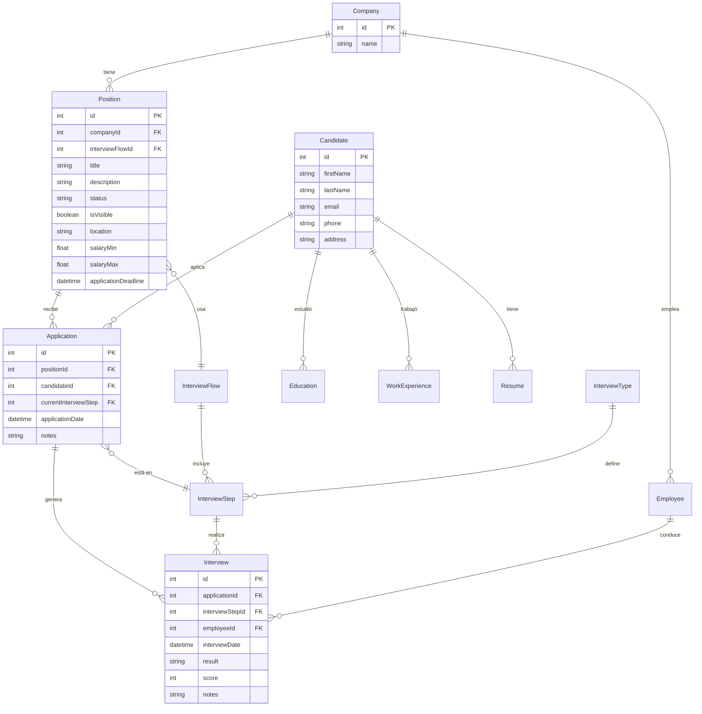

# Modelo de Datos - LTI Talent Tracking System

## 🗄️ Visión General

El sistema LTI utiliza un modelo de datos relacional diseñado para gestionar todo el ciclo de vida del proceso de reclutamiento. La base de datos está implementada en PostgreSQL y gestionada a través de Prisma ORM.

## 📊 Diagrama de Entidad-Relación



## 🏗️ Entidades del Sistema

### 1. **Company** (Empresa)
Representa las empresas que utilizan el sistema para reclutar talento.

| Campo | Tipo | Descripción | Restricciones |
|-------|------|-------------|---------------|
| `id` | `int` | Identificador único | PK, Auto-increment |
| `name` | `string` | Nombre de la empresa | NOT NULL, UNIQUE |

**Relaciones:**
- `positions`: Una empresa puede tener múltiples posiciones
- `employees`: Una empresa puede tener múltiples empleados

### 2. **Position** (Posición/Vacante)
Representa las posiciones de trabajo disponibles en las empresas.

| Campo | Tipo | Descripción | Restricciones |
|-------|------|-------------|---------------|
| `id` | `int` | Identificador único | PK, Auto-increment |
| `companyId` | `int` | ID de la empresa | FK, NOT NULL |
| `interviewFlowId` | `int` | ID del flujo de entrevistas | FK, NOT NULL |
| `title` | `string` | Título de la posición | NOT NULL |
| `description` | `string` | Descripción de la posición | NOT NULL |
| `status` | `string` | Estado de la posición | DEFAULT 'Draft' |
| `isVisible` | `boolean` | Visibilidad pública | DEFAULT false |
| `location` | `string` | Ubicación del trabajo | NOT NULL |
| `jobDescription` | `string` | Descripción detallada | NOT NULL |
| `requirements` | `string` | Requisitos del puesto | NULLABLE |
| `responsibilities` | `string` | Responsabilidades | NULLABLE |
| `salaryMin` | `float` | Salario mínimo | NULLABLE |
| `salaryMax` | `float` | Salario máximo | NULLABLE |
| `employmentType` | `string` | Tipo de empleo | NULLABLE |
| `benefits` | `string` | Beneficios | NULLABLE |
| `companyDescription` | `string` | Descripción de la empresa | NULLABLE |
| `applicationDeadline` | `datetime` | Fecha límite de aplicación | NULLABLE |
| `contactInfo` | `string` | Información de contacto | NULLABLE |

**Relaciones:**
- `company`: Pertenece a una empresa
- `interviewFlow`: Usa un flujo de entrevistas
- `applications`: Puede tener múltiples aplicaciones

### 3. **Candidate** (Candidato)
Representa a los candidatos que aplican a las posiciones.

| Campo | Tipo | Descripción | Restricciones |
|-------|------|-------------|---------------|
| `id` | `int` | Identificador único | PK, Auto-increment |
| `firstName` | `string` | Nombre | NOT NULL, VARCHAR(100) |
| `lastName` | `string` | Apellido | NOT NULL, VARCHAR(100) |
| `email` | `string` | Correo electrónico | NOT NULL, UNIQUE, VARCHAR(255) |
| `phone` | `string` | Teléfono | NULLABLE, VARCHAR(15) |
| `address` | `string` | Dirección | NULLABLE, VARCHAR(100) |

**Relaciones:**
- `educations`: Puede tener múltiples registros educativos
- `workExperiences`: Puede tener múltiples experiencias laborales
- `resumes`: Puede tener múltiples CVs
- `applications`: Puede tener múltiples aplicaciones

### 4. **Education** (Educación)
Representa la formación académica de los candidatos.

| Campo | Tipo | Descripción | Restricciones |
|-------|------|-------------|---------------|
| `id` | `int` | Identificador único | PK, Auto-increment |
| `candidateId` | `int` | ID del candidato | FK, NOT NULL |
| `institution` | `string` | Institución educativa | NOT NULL, VARCHAR(100) |
| `title` | `string` | Título/Grado obtenido | NOT NULL, VARCHAR(250) |
| `startDate` | `datetime` | Fecha de inicio | NOT NULL |
| `endDate` | `datetime` | Fecha de finalización | NULLABLE |

**Relaciones:**
- `candidate`: Pertenece a un candidato

### 5. **WorkExperience** (Experiencia Laboral)
Representa la experiencia laboral de los candidatos.

| Campo | Tipo | Descripción | Restricciones |
|-------|------|-------------|---------------|
| `id` | `int` | Identificador único | PK, Auto-increment |
| `candidateId` | `int` | ID del candidato | FK, NOT NULL |
| `company` | `string` | Empresa donde trabajó | NOT NULL, VARCHAR(100) |
| `position` | `string` | Cargo/Posición | NOT NULL, VARCHAR(100) |
| `description` | `string` | Descripción del trabajo | NULLABLE, VARCHAR(200) |
| `startDate` | `datetime` | Fecha de inicio | NOT NULL |
| `endDate` | `datetime` | Fecha de finalización | NULLABLE |

**Relaciones:**
- `candidate`: Pertenece a un candidato

### 6. **Resume** (CV/Currículum)
Representa los archivos de CV de los candidatos.

| Campo | Tipo | Descripción | Restricciones |
|-------|------|-------------|---------------|
| `id` | `int` | Identificador único | PK, Auto-increment |
| `candidateId` | `int` | ID del candidato | FK, NOT NULL |
| `filePath` | `string` | Ruta del archivo | NOT NULL, VARCHAR(500) |
| `fileType` | `string` | Tipo de archivo | NOT NULL, VARCHAR(50) |
| `uploadDate` | `datetime` | Fecha de subida | NOT NULL |

**Relaciones:**
- `candidate`: Pertenece a un candidato

### 7. **Employee** (Empleado)
Representa a los empleados de las empresas que participan en el proceso de reclutamiento.

| Campo | Tipo | Descripción | Restricciones |
|-------|------|-------------|---------------|
| `id` | `int` | Identificador único | PK, Auto-increment |
| `companyId` | `int` | ID de la empresa | FK, NOT NULL |
| `name` | `string` | Nombre del empleado | NOT NULL |
| `email` | `string` | Correo electrónico | NOT NULL, UNIQUE |
| `role` | `string` | Rol en la empresa | NOT NULL |
| `isActive` | `boolean` | Estado activo | DEFAULT true |

**Relaciones:**
- `company`: Pertenece a una empresa
- `interviews`: Puede conducir múltiples entrevistas

### 8. **InterviewFlow** (Flujo de Entrevistas)
Define la secuencia de pasos de entrevistas para una posición.

| Campo | Tipo | Descripción | Restricciones |
|-------|------|-------------|---------------|
| `id` | `int` | Identificador único | PK, Auto-increment |
| `description` | `string` | Descripción del flujo | NULLABLE |

**Relaciones:**
- `interviewSteps`: Incluye múltiples pasos de entrevista
- `positions`: Usado por múltiples posiciones

### 9. **InterviewType** (Tipo de Entrevista)
Define los diferentes tipos de entrevistas que se pueden realizar.

| Campo | Tipo | Descripción | Restricciones |
|-------|------|-------------|---------------|
| `id` | `int` | Identificador único | PK, Auto-increment |
| `name` | `string` | Nombre del tipo | NOT NULL |
| `description` | `string` | Descripción del tipo | NULLABLE |

**Relaciones:**
- `interviewSteps`: Define múltiples pasos de entrevista

### 10. **InterviewStep** (Paso de Entrevista)
Representa un paso específico en el flujo de entrevistas.

| Campo | Tipo | Descripción | Restricciones |
|-------|------|-------------|---------------|
| `id` | `int` | Identificador único | PK, Auto-increment |
| `interviewFlowId` | `int` | ID del flujo | FK, NOT NULL |
| `interviewTypeId` | `int` | ID del tipo | FK, NOT NULL |
| `name` | `string` | Nombre del paso | NOT NULL |
| `orderIndex` | `int` | Orden en el flujo | NOT NULL |

**Relaciones:**
- `interviewFlow`: Pertenece a un flujo de entrevistas
- `interviewType`: Es de un tipo específico
- `applications`: Usado por múltiples aplicaciones
- `interviews`: Genera múltiples entrevistas

### 11. **Application** (Aplicación)
Representa la aplicación de un candidato a una posición específica.

| Campo | Tipo | Descripción | Restricciones |
|-------|------|-------------|---------------|
| `id` | `int` | Identificador único | PK, Auto-increment |
| `positionId` | `int` | ID de la posición | FK, NOT NULL |
| `candidateId` | `int` | ID del candidato | FK, NOT NULL |
| `currentInterviewStep` | `int` | Paso actual | FK, NOT NULL |
| `applicationDate` | `datetime` | Fecha de aplicación | NOT NULL |
| `notes` | `string` | Notas adicionales | NULLABLE |

**Relaciones:**
- `position`: Aplicación a una posición
- `candidate`: Aplicación de un candidato
- `interviewStep`: Está en un paso específico
- `interviews`: Genera múltiples entrevistas

### 12. **Interview** (Entrevista)
Representa una entrevista específica realizada a un candidato.

| Campo | Tipo | Descripción | Restricciones |
|-------|------|-------------|---------------|
| `id` | `int` | Identificador único | PK, Auto-increment |
| `applicationId` | `int` | ID de la aplicación | FK, NOT NULL |
| `interviewStepId` | `int` | ID del paso | FK, NOT NULL |
| `employeeId` | `int` | ID del entrevistador | FK, NOT NULL |
| `interviewDate` | `datetime` | Fecha de la entrevista | NOT NULL |
| `result` | `string` | Resultado de la entrevista | NULLABLE |
| `score` | `int` | Puntuación | NULLABLE |
| `notes` | `string` | Notas de la entrevista | NULLABLE |

**Relaciones:**
- `application`: Pertenece a una aplicación
- `interviewStep`: Es de un paso específico
- `employee`: Conducida por un empleado

## 🔗 Relaciones y Cardinalidades

### Relaciones Principales

1. **Company → Position** (1:N)
   - Una empresa puede tener múltiples posiciones
   - Una posición pertenece a una empresa

2. **Company → Employee** (1:N)
   - Una empresa puede tener múltiples empleados
   - Un empleado pertenece a una empresa

3. **Position → Application** (1:N)
   - Una posición puede tener múltiples aplicaciones
   - Una aplicación es para una posición específica

4. **Candidate → Application** (1:N)
   - Un candidato puede tener múltiples aplicaciones
   - Una aplicación es de un candidato específico

5. **Candidate → Education** (1:N)
   - Un candidato puede tener múltiples registros educativos
   - Cada educación pertenece a un candidato

6. **InterviewFlow → InterviewStep** (1:N)
   - Un flujo puede tener múltiples pasos
   - Un paso pertenece a un flujo

7. **Application → Interview** (1:N)
   - Una aplicación puede generar múltiples entrevistas
   - Una entrevista pertenece a una aplicación

## 🔍 Índices y Optimizaciones

### Índices Principales

```sql
-- Índices automáticos (Primary Keys)
CREATE INDEX idx_candidate_pk ON "Candidate"(id);
CREATE INDEX idx_position_pk ON "Position"(id);
CREATE INDEX idx_application_pk ON "Application"(id);

-- Índices de claves foráneas
CREATE INDEX idx_education_candidate ON "Education"(candidateId);
CREATE INDEX idx_workexperience_candidate ON "WorkExperience"(candidateId);
CREATE INDEX idx_application_candidate ON "Application"(candidateId);
CREATE INDEX idx_application_position ON "Application"(positionId);
CREATE INDEX idx_interview_application ON "Interview"(applicationId);

-- Índices de consultas frecuentes
CREATE INDEX idx_candidate_email ON "Candidate"(email);
CREATE INDEX idx_position_status ON "Position"(status);
CREATE INDEX idx_application_date ON "Application"(applicationDate);
```

### Restricciones de Integridad

```sql
-- Restricciones de unicidad
ALTER TABLE "Candidate" ADD CONSTRAINT uk_candidate_email UNIQUE(email);
ALTER TABLE "Company" ADD CONSTRAINT uk_company_name UNIQUE(name);
ALTER TABLE "Employee" ADD CONSTRAINT uk_employee_email UNIQUE(email);

-- Restricciones de claves foráneas
ALTER TABLE "Education" ADD CONSTRAINT fk_education_candidate 
    FOREIGN KEY (candidateId) REFERENCES "Candidate"(id) ON DELETE CASCADE;
    
ALTER TABLE "Application" ADD CONSTRAINT fk_application_candidate 
    FOREIGN KEY (candidateId) REFERENCES "Candidate"(id) ON DELETE CASCADE;
```

## 📝 Consultas Comunes

### 1. Obtener candidatos con su educación y experiencia

```sql
SELECT 
    c.id,
    c.firstName,
    c.lastName,
    c.email,
    e.institution,
    e.title,
    w.company,
    w.position
FROM "Candidate" c
LEFT JOIN "Education" e ON c.id = e.candidateId
LEFT JOIN "WorkExperience" w ON c.id = w.candidateId
ORDER BY c.id;
```

### 2. Obtener aplicaciones activas con información del candidato

```sql
SELECT 
    a.id,
    a.applicationDate,
    c.firstName,
    c.lastName,
    c.email,
    p.title as positionTitle,
    comp.name as companyName
FROM "Application" a
JOIN "Candidate" c ON a.candidateId = c.id
JOIN "Position" p ON a.positionId = p.id
JOIN "Company" comp ON p.companyId = comp.id
WHERE p.status = 'Open'
ORDER BY a.applicationDate DESC;
```

### 3. Obtener flujo de entrevistas con sus pasos

```sql
SELECT 
    if.id,
    if.description,
    is.name as stepName,
    is.orderIndex,
    it.name as interviewType
FROM "InterviewFlow" if
JOIN "InterviewStep" is ON if.id = is.interviewFlowId
JOIN "InterviewType" it ON is.interviewTypeId = it.id
ORDER BY if.id, is.orderIndex;
```

## 🔄 Migración y Versionado

### Historial de Migraciones

| Versión | Fecha | Descripción |
|---------|-------|-------------|
| `20240528082702` | 2024-05-28 | Creación de entidades básicas (Candidate, Education, WorkExperience, Resume) |
| `20240528085016` | 2024-05-28 | Agregado de entidades del proceso de entrevistas |
| `20240528110522` | 2024-05-28 | Refinamiento de relaciones y constraints |
| `20240528140846` | 2024-05-28 | Ajustes finales y datos de ejemplo |

### Comandos de Migración

```bash
# Generar nueva migración
npx prisma migrate dev --name descripcion_del_cambio

# Aplicar migraciones
npx prisma migrate deploy

# Resetear base de datos (desarrollo)
npx prisma migrate reset
```

## 🎯 Consideraciones de Diseño

### Decisiones de Diseño

1. **Normalización**: Base de datos normalizada para evitar redundancia
2. **Integridad Referencial**: Uso extensivo de claves foráneas
3. **Flexibilidad**: Diseño que permite extensión futura
4. **Performance**: Índices en campos frecuentemente consultados
5. **Auditabilidad**: Campos de fecha para seguimiento temporal

### Escalabilidad

- **Particionamiento**: Preparado para particionar por empresa
- **Archivado**: Estructura que permite archivar datos antiguos
- **Indexación**: Índices optimizados para consultas frecuentes
- **Caching**: Estructura compatible con estrategias de cache

---

**Nota**: Este modelo de datos está diseñado para ser escalable y mantenible, siguiendo las mejores prácticas de diseño de bases de datos relacionales. 